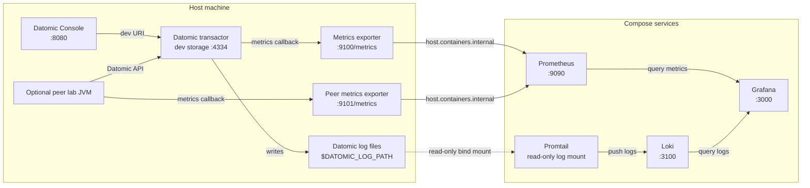

# Datomic Observability Stack

Metrics → Prometheus + Grafana. Logs → Loki (via Promtail) + Grafana.

The stack is Compose-provider agnostic at the script level: use the same
`docker compose` or `podman compose` selection as the root lab. The Datomic
JVMs remain on the host; only these four observability services are containers.

## Start

```bash
./build.sh   # select/download Datomic and install the metrics exporter
./start.sh   # transactor, Datomic Console, and observability; Ctrl+C to stop
```

See [README.md](README.md) for prerequisites and JVM configuration, and
[TROUBLESHOOTING.md](TROUBLESHOOTING.md) for Colima, Docker Compose, and Podman.
The optional peer is described separately in [peer-lab](peer-lab/README.md).
For an already manually managed transactor, `./observability/start.sh up` remains
available to start only the containers.

`DATOMIC_JAVA_OPTS` includes `-Duser.timezone=UTC`: Datomic log timestamps have no timezone,
and Promtail's pipeline (`location: "UTC"`) assumes the JVM that wrote them
was running in UTC. Without it, log timestamps in Loki will be off by the
attendee's local UTC offset.

- Datomic Console: http://localhost:8080/browse
- Grafana — Transactor Metrics: http://localhost:3000/d/datomic-overview (no login required for this local lab),
  opened automatically once startup confirms everything is healthy
- Prometheus: http://localhost:9090
- Loki: http://localhost:3100

## Stop

```bash
# Press Ctrl+C in the terminal running ./start.sh. Data is preserved.
```

Data (Prometheus TSDB, Loki chunks, Grafana state, Promtail positions) lives in
named Compose volumes — survives `down` / `up` cycles.

## Architecture



The same exporter runs in both JVMs. Which one a series came from is in its name:
`datomic_transactor_*` vs `datomic_peer_*`. Peer **logs** are not collected — they go to
the peer process's stdout, not to `$DATOMIC_LOG_PATH` where Promtail is looking.

## Key files

| File | Purpose |
|------|---------|
| `observability/docker-compose.yml` | All four services |
| `observability/prometheus/prometheus.yml` | Scrapes the transactor (:9100) and the peer (:9101) every 5s |
| `observability/loki/loki-config.yml` | 30-day retention, filesystem storage |
| `observability/promtail/promtail-config.yml` | Tails log/*.log, parses EDN, extracts labels |
| `observability/grafana/dashboards/datomic-overview.json` | Auto-provisioned dashboard — transactor |
| `observability/grafana/dashboards/datomic-peer.json` | Auto-provisioned dashboard — peer |
| `config/transactor.properties` | The transactor config, used in place — edit and run `./transactor-restart.sh` |
| `metrics-exporter/` | Prometheus exporter source — build with `clojure -T:build uberjar`, drop the jar in your Datomic lib/ |
| `peer-lab/` | A minimal peer that loads the same exporter — `clj -M:dev` |

## Metrics (Prometheus)

Exposed by `lab.datomic-metrics/metrics`, registered as Datomic's metrics callback —
in `transactor.properties` for the transactor, as `-Ddatomic.metricsCallback` for the peer.

### Transactor — `datomic_transactor_*`

Key ones:

- `datomic_transactor_available_mb` — free JVM heap
- `datomic_transactor_transaction_msec_{hi,sum,count}` — tx latency
- `datomic_transactor_transaction_batch_{hi,sum,count}` — datoms per tx
- `datomic_transactor_gc_pause_msec_{hi,sum,count}` — GC pauses
- `datomic_transactor_memory_index_mb_hi` — memory index size
- `datomic_transactor_memory_index_max_mb` / `_threshold_mb` — the configured
  `memory-index-max` / `memory-index-threshold`, read from
  `config/transactor.properties` by `start.sh` and exported once per process
  (Datomic itself doesn't report these as runtime metrics)
- `datomic_transactor_heartbeat_msec_hi` — peer heartbeat
- `datomic_transactor_storage_get/put_succeeded_msec_*` — storage latency
- JVM metrics via `jvm_*` (from JvmMetrics)

### Peer — `datomic_peer_*`

A peer reads; it does not write to storage. So there is no `storage_put_*` and no
transaction latency here — a different set, not a subset:

- `datomic_peer_object_cache_count` — segments in this peer's cache
- `datomic_peer_object_cache_2_{sum,count}` — cache hits / lookups; `sum/count` is the hit rate
- `datomic_peer_storage_get_{msec,bytes}_*` — reads that missed the cache
- `datomic_peer_deserialize_msec_*` — turning fetched segments into usable data
- `datomic_peer_peer_accept_new_msec_*` — absorbing each transaction report from the transactor
- `datomic_peer_log_ingest_{msec,bytes}_*` — reading the transaction log
- `datomic_peer_pool_read_ahead_{active,queued}_*` — the peer's prefetch pool

`jvm_*` comes from both JVMs under the same names — filter by `job="datomic-peer"`.

> `object_cache_2` is not a typo. Datomic reports `:ObjectCacheCount` (a number) and
> `:ObjectCache` (a map) in the same report and both normalize to `..._object_cache_count`;
> the exporter moves the second to `..._2` rather than letting them share a gauge.
> See [metrics-exporter](metrics-exporter/README.md#exported-metrics).

## Logs (Loki)

Promtail tails `$DATOMIC_LOG_PATH/*.log` and extracts:

**Labels** (low-cardinality, for filtering):
- `job=datomic`
- `level` — INFO / WARN / ERROR
- `event` — e.g. `metrics`, `transactor/heartbeat`, `gc`
- `logger` — e.g. `datomic.process-monitor`

**Structured metadata** (numeric, extracted from EDN on `:event :metrics` lines):
`available_mb`, `object_cache_count`, `gc_pause_msec_{hi,sum,count}`,
`heartbeat_msec_{hi,sum,count}`, `memory_index_mb_{hi,count}`,
`transaction_msec_{hi,sum,count}`, `transaction_batch_{hi,sum,count}`,
`storage_{get,put}_msec_{hi,sum,count}`, `indexing_job_msec_{hi,sum,count}`,
`remote_peers_count`

### Useful LogQL queries

```logql
# All log events (non-debug)
{job="datomic"} | event != ``

# Only errors/warnings
{job="datomic"} | level =~ `WARN|ERROR`

# Metrics windows where transactions occurred
{job="datomic", event="metrics"} | transaction_msec_count != ``

# Transaction rate (metric query, use in graph panel)
sum_over_time(
  {job="datomic", event="metrics"}
    | transaction_msec_count != ``
    | unwrap transaction_msec_count [1m]
)

# Available memory over time (historical, from logs)
avg_over_time(
  {job="datomic", event="metrics"}
    | available_mb != ``
    | unwrap available_mb [5m]
)
```

## Loki config fixes applied (for reference)

Two issues hit on first run with Loki 3.4.2:
1. `retention_enabled: true` requires `compactor.delete_request_store: filesystem`
2. Default ingestion limit (4MB/s) too low for bulk-loading months of historical logs →
   raised to `ingestion_rate_mb: 64` and `per_stream_rate_limit: 32MB`

## Rebuilding the exporter

```bash
cd metrics-exporter
clojure -T:build uberjar
cp target/datomic-metrics-standalone.jar \
   /path/to/datomic-pro/lib/datomic-metrics-standalone.jar
```
