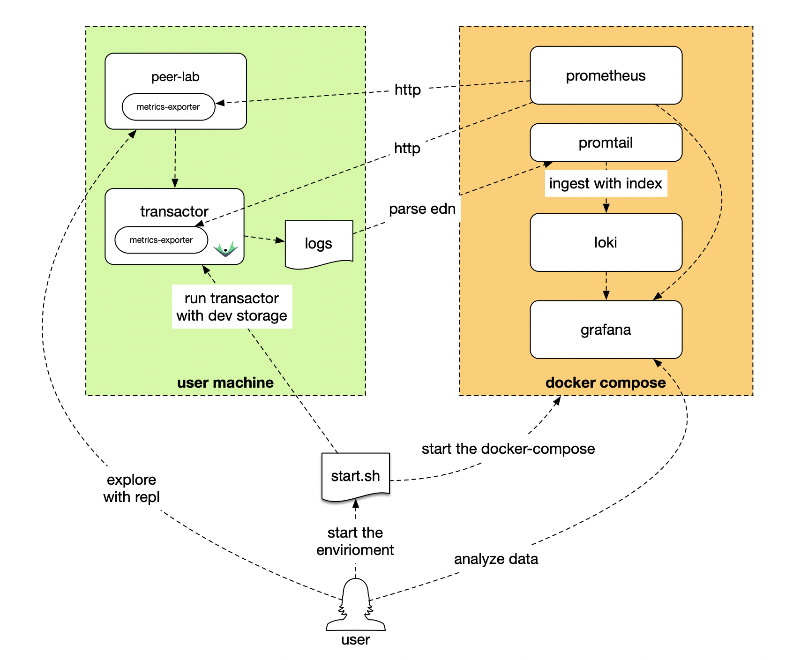

# Datomic Lab

A small, local Datomic Pro learning environment.

It gives you a Datomic transactor, Datomic Console, an optional peer REPL, and
an observability stack with Prometheus, Grafana, Loki, and Promtail. The
transactor, Console, and peer run as JVM processes on your host. Only the
observability services run in a container runtime.

This is deliberately a development lab, not a production deployment:

- the transactor uses Datomic `dev` storage and local disk;
- the default configuration has no authentication and binds to localhost;
- there is one transactor, no HA, and no external storage service;
- the downloaded Datomic installation and local databases are part of your
  working state and are not committed to this repository.

The point is to have a quiet place to learn Datomic itself: create databases,
define schema, transact data, query it from Console or a peer, and watch the
transactor work.

## Architecture overview



## What runs where

| On your host | In the container runtime |
| --- | --- |
| Datomic transactor (`4334`, `4335`) | Prometheus (`9090`) |
| Datomic metrics exporter (`9100`) | Grafana (`3000`) |
| Datomic Console (`8080`) | Loki (`3100`) |
| Optional peer REPL and exporter (`9101`) | Promtail, reading Datomic logs |

The host/container boundary matters in two places. Prometheus must reach the
host JVM at `9100`, and Promtail must be able to read the Datomic log directory.
The Compose file configures the conventional `host.containers.internal` route
and a read-only log bind mount. Docker Desktop and Colima are common choices;
Podman is supported when its machine and Compose provider provide the same
host route and bind-mount access. See [Troubleshooting](TROUBLESHOOTING.md) if
your runtime uses different networking or file-sharing rules.

## Prerequisites

Run the scripts from macOS or Linux with Bash. The scripts do not install
software, start a VM, change a Docker context, or create a database for you.

Install or make available on `PATH`:

| Tool | Why it is needed |
| --- | --- |
| Java 17, 21, or 25 | Runs the Datomic transactor and Console |
| Clojure CLI | Builds the metrics exporter and runs the peer lab |
| `curl` | Downloads Datomic and performs readiness checks |
| `unzip` | Extracts Datomic when the lab downloads it |
| `lsof` | Checks host ports before startup |
| `pgrep` | Lets `./stop.sh` recover an interrupted session |
| A browser | Opens Console and Grafana; optional, but useful |

Choose one container runtime:

| Runtime | Required command | Configuration |
| --- | --- | --- |
| Docker Engine, Docker Desktop, or Colima | `docker compose` | Automatic when it is the first working provider; optionally set `DATOMIC_COMPOSE='docker compose'` |
| Podman with a running Podman machine and Compose provider | `podman compose` | Set `DATOMIC_COMPOSE='podman compose'` in `.env` |

The scripts intentionally support the modern subcommand form (`docker compose`
or `podman compose`). The old standalone `docker-compose` command is not
selected by the scripts.

Check the tools before starting:

```bash
java -version
clojure -Sdescribe
curl --version
unzip -v
lsof -v
```

Then check the runtime you chose:

```bash
# Docker, Docker Desktop, or Colima
docker compose version
docker info

# Or Podman
podman compose version
podman info
```

### Runtime-specific setup

With Docker Desktop, start Docker Desktop and wait for its engine to be ready.
With Colima, start the profile whose Docker context you intend to use:

```bash
colima start
colima status
docker context show
docker info
```

Use `docker context use colima` only when you need to select that context.

With Podman on macOS or another host that uses a VM, initialize and start its
machine once, then verify `podman info` and `podman compose version`. If both
Docker and Podman are installed, set `DATOMIC_COMPOSE` explicitly; otherwise
the scripts prefer a working Docker Compose provider.

For a comfortable learning session, give the container VM about 4 CPUs and
4 GiB of memory. Reserve enough disk for the Datomic distribution, container
images, observability volumes, and your local databases. A 100 GiB VM disk is
comfortable for repeated experiments, but is not a Datomic requirement.

The repository and the directory selected by `DATOMIC_LOG_PATH` must be
visible to the container VM. This is automatic for many Docker Desktop and
Colima layouts, but may require an explicit shared directory with another VM
runtime. The default repository path is under your home directory, which is a
good place to keep it.

## Start the complete lab

From the repository root:

```bash
./build.sh
./start.sh
```

The first command:

1. checks Java, Clojure, the container runtime, and Compose;
2. selects an existing Datomic Pro installation or downloads the pinned
   Datomic Pro `1.0.7705` distribution from the official public archive;
3. records the selected installation in the ignored `.env` file;
4. builds the in-process Prometheus exporter and installs its JAR into that
   Datomic installation; and
5. validates the observability Compose configuration.

If no Datomic installation is configured, pressing Enter accepts
`./datomic-pro` and downloads there. To use an existing installation instead:

```bash
./build.sh /absolute/path/to/datomic-pro
```

For an unattended download into `./datomic-pro`:

```bash
DATOMIC_DOWNLOAD=1 ./build.sh
```

The second command starts the four observability containers, the transactor,
and Console, then waits for the transactor metrics and logs to reach the
observability stack. The first metrics report may take about a minute. The
terminal remains attached to the session; keep it open.

When startup succeeds, open:

| Service | URL |
| --- | --- |
| Datomic Console | <http://localhost:8080/browse> |
| Grafana — Transactor dashboard | <http://localhost:3000/d/datomic-overview> |
| Prometheus | <http://localhost:9090> |
| Loki | <http://localhost:3100> |

Grafana allows anonymous local access. Startup attempts to open the transactor
dashboard in your default browser, but that convenience is optional.

The Console is connected to the `dev` transactor alias at
`datomic:dev://localhost:4334/`. Startup does not create a database. Create
one in Console or from the peer lab.

## First learning loop

Once the lab is running:

1. Open Console and create a database, for example `lab`.
2. Explore the schema and query editor. Start with a small schema and a few
   transactions; keep the first experiments easy to inspect.
3. Open Grafana's **Datomic → Transactor Metrics** dashboard. Allow about a
   minute for the first panels to populate.
4. When you want application-side code, use the optional peer REPL described
   in [peer-lab/README.md](peer-lab/README.md). It includes a small item
   schema, transactions, queries, and a separate peer metrics endpoint.

The peer lab is intentionally not started by `./start.sh`: it is a separate
process so you can stop, edit, and restart your experiments without restarting
the transactor.

## Verify the session

Reaching the `Keep this terminal open` message means the required services,
the transactor scrape, and the log pipeline passed startup checks. You can also
check the endpoints from another terminal:

```bash
curl -s http://localhost:9100/metrics | head
curl -s http://localhost:3000/api/health
curl -s http://localhost:9090/-/ready
```

If you start the peer lab, its exporter is separate:

```bash
curl -s http://localhost:9101/metrics | head
```

An empty peer dashboard before the peer has connected is expected.

## Stop, recover, and restart

Press `Ctrl+C` in the terminal running `./start.sh`. The script stops the two
Datomic JVMs and the Compose stack while preserving Datomic data and named
observability volumes. Run `./start.sh` again for the next session.

If the terminal was killed and the processes or containers remain, inspect
them and run:

```bash
./stop.sh
```

`./stop.sh` is a recovery command; it does not delete data. If you edit
`config/transactor.properties` during a live session, apply the change without
rebuilding the exporter or restarting Console:

```bash
./transactor-restart.sh
```

The Console may need to reconnect after this restart. Read
[Troubleshooting](TROUBLESHOOTING.md) before manually removing a session marker
or storage directory.

## Configuration

`.env` is the local, ignored record of the setup. `./build.sh` creates it from
[`.env.example`](.env.example) when needed and records `DATOMIC_HOME` in it.
Explicit environment variables override values in `.env`.

Common settings are:

| Setting | Purpose |
| --- | --- |
| `DATOMIC_HOME` | Absolute path to an existing Datomic Pro installation |
| `DATOMIC_VERSION` | Download version; defaults to `1.0.7705` |
| `DATOMIC_DOWNLOAD=1` | Select download automatically when no installation is configured |
| `DATOMIC_COMPOSE` | Choose `docker compose` or `podman compose` explicitly |
| `DATOMIC_TRANSACTOR_CONFIG` | Absolute path to another properties file; default is `config/transactor.properties` |
| `DATOMIC_LOG_PATH` | Absolute directory mounted read-only for log collection; default is `$DATOMIC_HOME/log` |
| `DATOMIC_CONSOLE_PORT` | Console port; default is `8080` |
| `DATOMIC_URI` | Console's transactor URI; default is `datomic:dev://localhost:4334/` |
| `DATOMIC_JAVA_OPTS` | Full JVM option list for the transactor |
| `DATOMIC_CONSOLE_JAVA_OPTS` | JVM option list for Console |
| `DATOMIC_START_TIMEOUT` | Readiness timeout in seconds; default is `180` |

For example:

```bash
DATOMIC_JAVA_OPTS='-Xms1g -Xmx2g -XX:+UseG1GC -XX:MaxGCPauseMillis=100 -Duser.timezone=UTC'
DATOMIC_CONSOLE_JAVA_OPTS='-Xmx512m -Duser.timezone=UTC'
```

Keep `-Duser.timezone=UTC`: the log collector parses Datomic timestamps as
UTC. `DATOMIC_JAVA_OPTS` replaces the complete transactor option list, so keep
the heap, GC, and timezone options you need. Values in `.env` are trusted shell
configuration; do not put secrets there unless you understand that they are
read by the startup scripts.

The transactor properties file is read in place. Edit
[`config/transactor.properties`](config/transactor.properties), then run
`./transactor-restart.sh` during a live session or `./start.sh` next time.
Changing the transactor host or port also requires matching `DATOMIC_URI` and
the relevant observability configuration. The lab does not provision external
storage or convert this setup into an HA deployment.

## Further reading

- [Datomic Pro setup](https://docs.datomic.com/setup/pro-setup.html)
- [Datomic transactor reference](https://docs.datomic.com/operation/transactor.html)
- [Datomic Console](https://docs.datomic.com/resources/console.html)
- [Observability details](OBSERVABILITY.md)
- [Setup and troubleshooting](TROUBLESHOOTING.md)
- [Metrics exporter](metrics-exporter/README.md)
- [Optional peer lab](peer-lab/README.md)
