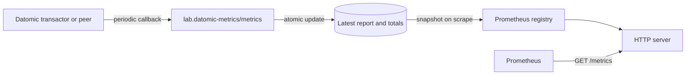

# Datomic metrics exporter

An in-process Prometheus exporter for Datomic transactors and peers.

Datomic calls a configured callback with its periodic metrics report. This
namespace stores the latest report, exposes it at `/metrics`, and also exposes
JVM metrics from the same process.

The exporter is deliberately small in concept:



There is no queue between Datomic and Prometheus. A scrape sees the most
recent report that has been accepted by the exporter. The HTTP server starts
lazily on the first callback; call `start!` to open it earlier.

## Install

Build the standalone jar:

```bash
clojure -T:build uberjar
```

Copy it into the Datomic installation used by the process that will load the
callback:

```bash
cp target/datomic-metrics-standalone.jar "$DATOMIC_HOME/lib/"
```

The jar contains the exporter source and its Prometheus dependencies, but no
Clojure runtime. This is intentional: Datomic supplies the Clojure runtime in
its own installation, and bundling another copy would make classpath order
significant. The build basis uses only the production dependencies; Clojure is
declared only in the `:dev` alias and is combined with `:test` for local work.

Datomic compiles `lab.datomic-metrics` from the jar when it loads the callback
namespace, so the exporter uses the Clojure version supplied by that Datomic
installation.

## Configure the callback

For a transactor, add this to `transactor.properties`:

```properties
metrics-callback=lab.datomic-metrics/metrics
```

For a peer, set this JVM property before the Datomic namespaces load:

```text
-Ddatomic.metricsCallback=lab.datomic-metrics/metrics
```

Setting the peer property from a REPL is too late.

## Configure the endpoint

Each setting is read from a system property, then an environment variable,
then its default:

| System property | Environment variable | Default | Meaning |
|---|---|---:|---|
| `datomic.metrics.port` | `DATOMIC_METRICS_PORT` | `9100` | Port for `/metrics` |
| `datomic.metrics.prefix` | `DATOMIC_METRICS_PREFIX` | `datomic_transactor_` | Prefix for exported Datomic names |

For example, a peer on the same machine can use:

```text
-Ddatomic.metrics.port=9101
-Ddatomic.metrics.prefix=datomic_peer_
```

The server is created once per JVM and binds the configured port. If the port
cannot be opened, the callback still records reports; the failure is logged to
stderr and the endpoint remains unavailable.

## Exported metrics

### Datomic report values

Every key in the report is handled generically, so a new Datomic key does not
require a code change.

A scalar becomes one gauge. For example:

```clojure
{:AvailableMB 921.0}
```

becomes:

```text
datomic_transactor_available_mb 921.0
```

CamelCase is converted to snake_case, the configured prefix is prepended, and
characters outside `[A-Za-z0-9_:]` become `_`.

A map value must contain the four Datomic interval fields `:lo`, `:hi`, `:sum`,
and `:count`. It produces four gauges and two cumulative counters:

| Report field | Exported series | Type |
|---|---|---|
| `:lo` | `…_lo` | gauge |
| `:hi` | `…_hi` | gauge |
| `:sum` | `…_sum` | gauge |
| `:count` | `…_count` | gauge |
| `:sum` | `…_sum_counter_total` | counter |
| `:count` | `…_count_counter_total` | counter |

The four gauge values describe only the latest reporting interval. They are
reset to zero when the key is absent from a later report. The two counter
series accumulate valid, non-negative interval values and are not rewound;
use them with `rate()` when missed scrapes must not lose activity.

The interval fields are gauges, not a Prometheus summary. Datomic can replace
or omit them on every report, while a summary's `_sum` and `_count` are
monotonic by definition.

Counters are published from the first valid report, including a report whose
values are zero. Negative interval values contribute zero rather than reducing
the cumulative total.

### Name collisions

Metric names are claimed for the lifetime of the JVM. If two Datomic keys
normalize to the same Prometheus series, the later key receives `_2`, `_3`, and
so on. Collision detection considers every series a map will create, including
the counter metadata names that are exposed with `_total`.

Two built-in Datomic names need a stable exception because their generated
names overlap:

| Datomic key | Base/series |
|---|---|
| `:ObjectCacheCount` | `…_object_cache_count` |
| `:ObjectCache` | `…_object_cache_2_{lo,hi,sum,count}` and corresponding counters |

These names are reserved before any report is processed, so their result does
not depend on report order. For other collisions, the first observed key keeps
the unqualified name.

### JVM and static configuration metrics

`JvmMetrics` contributes `jvm_*` series to the same endpoint.

The exporter can also publish configured transactor limits as gauges. These
are configuration readings, not values from the Datomic report:

| System property | Environment variable | Series suffix |
|---|---|---|
| `datomic.metrics.memoryIndexMaxMB` | `DATOMIC_METRICS_MEMORY_INDEX_MAX_MB` | `memory_index_max_mb` |
| `datomic.metrics.memoryIndexThresholdMB` | `DATOMIC_METRICS_MEMORY_INDEX_THRESHOLD_MB` | `memory_index_threshold_mb` |
| `datomic.metrics.objectCacheMaxMB` | `DATOMIC_METRICS_OBJECT_CACHE_MAX_MB` | `object_cache_max_mb` |

When set to a number, each is exported with the configured prefix. For
example, the first setting becomes
`datomic_transactor_memory_index_max_mb`.

### Missing and invalid values

Datomic may omit a key when there is nothing to report. Gauges are therefore
zeroed before each new report is applied; a previous alarm or peak does not
remain latched. Cumulative counters retain their totals.

Each report value is converted independently. A malformed or unsupported value
is logged to stderr and skipped, while the rest of the report is retained. The
same isolation applies while building scrape snapshots: one invalid series does
not take down the whole `/metrics` response or the JVM metrics.

## Development

Run the test suite:

```bash
clojure -M:dev:test
```

## Operational model

- The exporter must run inside the Datomic JVM whose report it receives. It is
  not a separate process that polls Datomic.
- Collectors are registered once in Prometheus's JVM-global default registry.
  Other collectors registered in that JVM are served by the same endpoint.
- Name assignment and endpoint initialization are synchronized. Each report is
  applied atomically, and each scrape reads one state snapshot.
- State grows with the number of distinct metric keys, not with the number of
  reports. Omitted gauges become zero; cumulative counters remain available.
