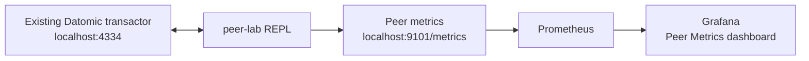

# peer-lab

`peer-lab` is a small Clojure REPL example for connecting to an already-running
Datomic transactor. It gives you an easy peer process for running queries,
submitting transactions, and exposing peer metrics on port `9101`.

It does not start a transactor, create containers, or replace the transactor.
The transactor must already be reachable at the URI configured in
[`src/lab/peer.clj`](src/lab/peer.clj).



## Start

The peer dependency is Datomic `1.0.7705`; use a matching transactor version.
The default URI is `datomic:dev://localhost:4334/lab`.

If you are using the complete lab from this repository, start the transactor
and observability stack first:

```bash
./build.sh   # first time only
./start.sh
```

If your transactor is already running elsewhere, only start the observability
stack if you want Prometheus and Grafana. Then start the peer REPL:

```bash
clj -M:dev
```

The `:dev` alias configures the metrics callback, the `datomic_peer_` metric
prefix, and port `9101`. It starts a plain REPL; evaluate the forms below
yourself.

## Connect and use the peer

Evaluate these forms in the REPL:

```clojure
(require '[datomic.api :as d]
         '[lab.peer :as peer])

;; Open the metrics endpoint immediately.
(require 'lab.datomic-metrics)
(lab.datomic-metrics/start!)

;; Connect to the existing transactor.
(def conn (d/connect peer/db-uri))

;; Optional: create the example database and install its schema.
(d/create-database peer/db-uri)
@(d/transact conn peer/schema)

;; Submit a transaction through the transactor.
@(d/transact conn [{:item/sku "sku-1"
                    :item/name "mouse"
                    :item/qty 7}])

;; Query the database through the peer.
(d/q '[:find ?sku ?name ?qty
       :where
       [?e :item/sku ?sku]
       [?e :item/name ?name]
       [?e :item/qty ?qty]]
     (d/db conn))
```

The example schema and URI are intentionally easy to edit.

## Metrics and Grafana

Check that the peer exporter is open:

```bash
curl http://localhost:9101/metrics
```

When Prometheus and Grafana are running, open the **Datomic → Peer Metrics**
dashboard. Datomic reports peer metrics about once a minute, so allow up to two
minutes for panels to populate.

Peer metrics use the `datomic_peer_` prefix so they remain separate from the
transactor's `datomic_transactor_` metrics. Peer logs are printed by the REPL;
they are not collected by the transactor log pipeline.

## Troubleshooting

- `Connection refused`: confirm that the transactor is running and that
  `peer/db-uri` matches its host, port, and database.
- No peer dashboard data: confirm the peer endpoint responds on `9101`, then
  wait for the next Datomic metrics report.
- The endpoint does not open: start the REPL with `clj -M:dev`; the metrics
  callback must be configured as a JVM option before Datomic loads.
